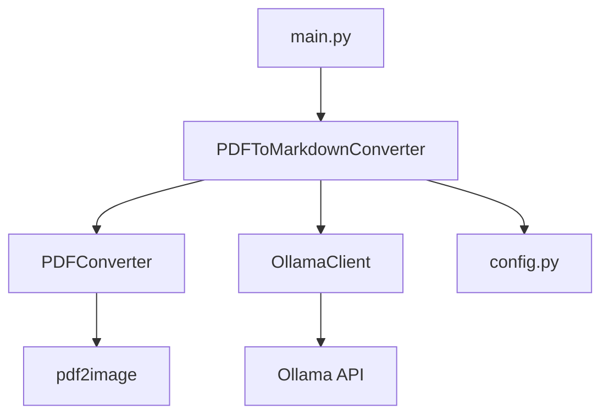
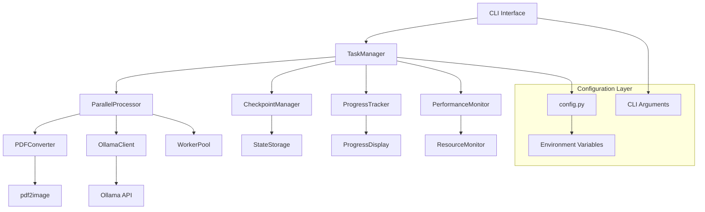

# Design Document

## Overview

PDF to Markdown 변환기의 성능과 사용성을 개선하기 위한 설계 문서입니다. 현재 시스템은 순차적 처리 방식으로 동작하며, CLI 인터페이스와 진행 상태 관리 기능이 제한적입니다. 이 설계는 병렬 처리, 향상된 CLI, 체크포인트 시스템, 성능 모니터링 기능을 추가하여 대용량 PDF 처리에 최적화된 시스템을 구축하는 것을 목표로 합니다.

## Architecture

### 현재 아키텍처 분석



### 개선된 아키텍처



## Components and Interfaces

### 1. CLI Interface Module (`cli.py`)

**목적**: 사용자 인터페이스 및 명령행 인수 처리

**주요 기능**:
- 명령행 인수 파싱 (argparse 사용)
- 도움말 및 사용법 표시
- 설정 검증 및 초기화

**인터페이스**:
```python
class CLIInterface:
    def parse_arguments(self) -> argparse.Namespace
    def validate_arguments(self, args: argparse.Namespace) -> bool
    def display_help(self) -> None
    def list_available_pdfs(self) -> None
```

### 2. Task Manager (`task_manager.py`)

**목적**: 전체 작업 흐름 관리 및 조정

**주요 기능**:
- 작업 큐 관리
- 의존성 해결
- 오류 처리 및 복구

**인터페이스**:
```python
class TaskManager:
    def __init__(self, config: Config, checkpoint_manager: CheckpointManager)
    def create_task_queue(self, pdf_files: List[str]) -> Queue
    def execute_tasks(self, task_queue: Queue) -> TaskResult
    def handle_task_failure(self, task: Task, error: Exception) -> None
```

### 3. Parallel Processor (`parallel_processor.py`)

**목적**: 병렬 처리 엔진

**주요 기능**:
- 멀티프로세싱/멀티스레딩 관리
- 작업 분산 및 로드 밸런싱
- 리소스 사용량 제어

**인터페이스**:
```python
class ParallelProcessor:
    def __init__(self, max_workers: int, resource_monitor: ResourceMonitor)
    def process_pdfs_parallel(self, pdf_tasks: List[PDFTask]) -> List[Result]
    def process_pages_parallel(self, page_tasks: List[PageTask]) -> List[Result]
    def adjust_worker_count(self, current_load: float) -> None
```

### 4. Checkpoint Manager (`checkpoint_manager.py`)

**목적**: 작업 진행 상태 저장 및 복원

**주요 기능**:
- 체크포인트 생성 및 저장
- 작업 상태 복원
- 무결성 검증

**인터페이스**:
```python
class CheckpointManager:
    def save_checkpoint(self, state: ProcessingState) -> None
    def load_checkpoint(self) -> Optional[ProcessingState]
    def clear_checkpoint(self) -> None
    def validate_checkpoint(self) -> bool
```

### 5. Progress Tracker (`progress_tracker.py`)

**목적**: 진행 상황 추적 및 표시

**주요 기능**:
- 다중 레벨 진행률 추적
- ETA 계산
- 실시간 업데이트

**인터페이스**:
```python
class ProgressTracker:
    def __init__(self, total_tasks: int)
    def update_progress(self, task_id: str, progress: float) -> None
    def display_progress(self) -> None
    def calculate_eta(self) -> timedelta
```

### 6. Performance Monitor (`performance_monitor.py`)

**목적**: 시스템 리소스 모니터링

**주요 기능**:
- CPU, 메모리, 디스크 사용량 모니터링
- 성능 통계 수집
- 자동 최적화 제안

**인터페이스**:
```python
class PerformanceMonitor:
    def start_monitoring(self) -> None
    def get_current_stats(self) -> ResourceStats
    def should_throttle(self) -> bool
    def generate_report(self) -> PerformanceReport
```

### 7. Enhanced PDF Converter (`pdf_converter.py` 개선)

**기존 기능 유지 + 추가 기능**:
- 병렬 페이지 처리
- 메모리 최적화
- 진행 상황 콜백

**개선된 인터페이스**:
```python
class PDFConverter:
    def convert_pdf_to_images_parallel(self, pdf_path: Path, 
                                     progress_callback: Callable) -> List[Path]
    def estimate_processing_time(self, pdf_path: Path) -> timedelta
    def optimize_memory_usage(self) -> None
```

### 8. Enhanced Ollama Client (`ollama_client.py` 개선)

**기존 기능 유지 + 추가 기능**:
- 연결 풀 관리
- 자동 재시도 메커니즘
- 배치 처리 최적화

**개선된 인터페이스**:
```python
class OllamaClient:
    def convert_images_batch(self, image_paths: List[Path], 
                           batch_size: int = 5) -> List[str]
    def health_check_with_retry(self, max_retries: int = 3) -> bool
    def get_connection_pool(self) -> ConnectionPool
```

## Data Models

### 1. Task Models

```python
@dataclass
class PDFTask:
    pdf_path: Path
    output_path: Path
    priority: int
    estimated_time: timedelta
    status: TaskStatus

@dataclass
class PageTask:
    image_path: Path
    page_number: int
    pdf_name: str
    retry_count: int = 0

@dataclass
class TaskResult:
    task_id: str
    success: bool
    output_path: Optional[Path]
    error_message: Optional[str]
    processing_time: timedelta
```

### 2. Progress Models

```python
@dataclass
class ProgressState:
    total_pdfs: int
    completed_pdfs: int
    current_pdf: str
    total_pages: int
    completed_pages: int
    start_time: datetime
    estimated_completion: datetime

@dataclass
class ResourceStats:
    cpu_usage: float
    memory_usage: float
    disk_usage: float
    network_usage: float
    timestamp: datetime
```

### 3. Checkpoint Models

```python
@dataclass
class ProcessingState:
    session_id: str
    completed_pdfs: List[str]
    failed_pdfs: List[str]
    current_pdf: Optional[str]
    completed_pages: Dict[str, List[int]]
    configuration: Dict[str, Any]
    timestamp: datetime
```

## Error Handling

### 1. 오류 분류 체계

```python
class ProcessingError(Exception):
    """기본 처리 오류"""
    pass

class RetryableError(ProcessingError):
    """재시도 가능한 오류"""
    pass

class FatalError(ProcessingError):
    """치명적 오류 (재시도 불가)"""
    pass

class ResourceError(ProcessingError):
    """리소스 부족 오류"""
    pass
```

### 2. 오류 처리 전략

- **네트워크 오류**: 지수 백오프 재시도 (최대 3회)
- **메모리 부족**: 배치 크기 감소 후 재시도
- **파일 I/O 오류**: 권한 확인 후 재시도
- **Ollama 서버 오류**: 연결 재설정 후 재시도

### 3. 복구 메커니즘

```python
class ErrorRecoveryManager:
    def handle_error(self, error: Exception, context: Dict) -> RecoveryAction
    def apply_recovery_strategy(self, action: RecoveryAction) -> bool
    def log_error_details(self, error: Exception, context: Dict) -> None
```

## Testing Strategy

### 1. 단위 테스트

**테스트 대상**:
- 각 모듈의 핵심 기능
- 오류 처리 로직
- 데이터 모델 검증

**테스트 도구**: pytest, unittest.mock

### 2. 통합 테스트

**테스트 시나리오**:
- 전체 워크플로우 테스트
- 병렬 처리 안정성 테스트
- 체크포인트 복원 테스트

### 3. 성능 테스트

**측정 항목**:
- 처리 속도 개선 정도
- 메모리 사용량 최적화
- 병렬 처리 효율성

### 4. 스트레스 테스트

**테스트 조건**:
- 대용량 PDF 파일 (1000+ 페이지)
- 동시 다중 PDF 처리
- 시스템 리소스 한계 상황

## Configuration Management

### 1. 설정 계층 구조

```python
class Config:
    # 기본 설정
    DEFAULT_CONFIG = {
        'parallel': {
            'max_pdf_workers': 2,
            'max_page_workers': 4,
            'batch_size': 5
        },
        'performance': {
            'memory_limit_mb': 4096,
            'cpu_threshold': 80.0,
            'auto_throttle': True
        },
        'checkpoint': {
            'save_interval': 60,  # seconds
            'backup_count': 3
        }
    }
```

### 2. 동적 설정 조정

```python
class DynamicConfig:
    def adjust_based_on_system(self) -> None
    def optimize_for_pdf_size(self, pdf_size: int) -> None
    def apply_user_preferences(self, args: argparse.Namespace) -> None
```

## Security Considerations

### 1. 파일 시스템 보안
- 경로 순회 공격 방지
- 파일 권한 검증
- 임시 파일 안전한 정리

### 2. 메모리 보안
- 민감한 데이터 메모리 정리
- 버퍼 오버플로우 방지
- 메모리 누수 모니터링

### 3. 네트워크 보안
- Ollama API 연결 검증
- 타임아웃 설정
- 재시도 제한

## Deployment Considerations

### 1. 의존성 관리
- 새로운 패키지 추가: `psutil`, `concurrent.futures`, `argparse`
- 버전 호환성 확인
- 가상 환경 권장

### 2. 시스템 요구사항
- 최소 메모리: 4GB
- 권장 메모리: 8GB+
- CPU 코어: 4개 이상 권장

### 3. 모니터링 및 로깅
- 구조화된 로깅 (JSON 형식)
- 성능 메트릭 수집
- 오류 추적 및 알림